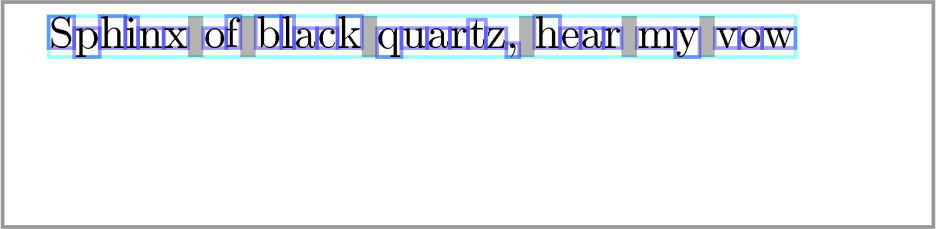

# Running yex

yex can be run as an application. But it's also a Python library.
You can use it either way.

## Running yex as an application

You'll need to [install it from source](installing.md), if you
haven't already.

You can run yex by typing `yex filename.tex`. For example, try making
yourself a file `test.tex` containing:
```
\shipout\hbox{The quick brown fox jumps over the lazy dog.}
```

Now run
```
yex test.tex
```

At present, yex outputs only to an SVG file called `yex.svg`, including
all the construction lines.
Open this file in some sort of graphics viewer, such as your web browser,
and you should see


though you might have to zoom in a bit: 10pt text is quite small.

## Running yex as a Python library

Here's a simple example:
```
import yex

doc = yex.Document()
doc.read(r"""
\shipout\hbox{Sphinx of black quartz, hear my vow}
""")

doc.save("sphinx.svg")
```

which should produce


